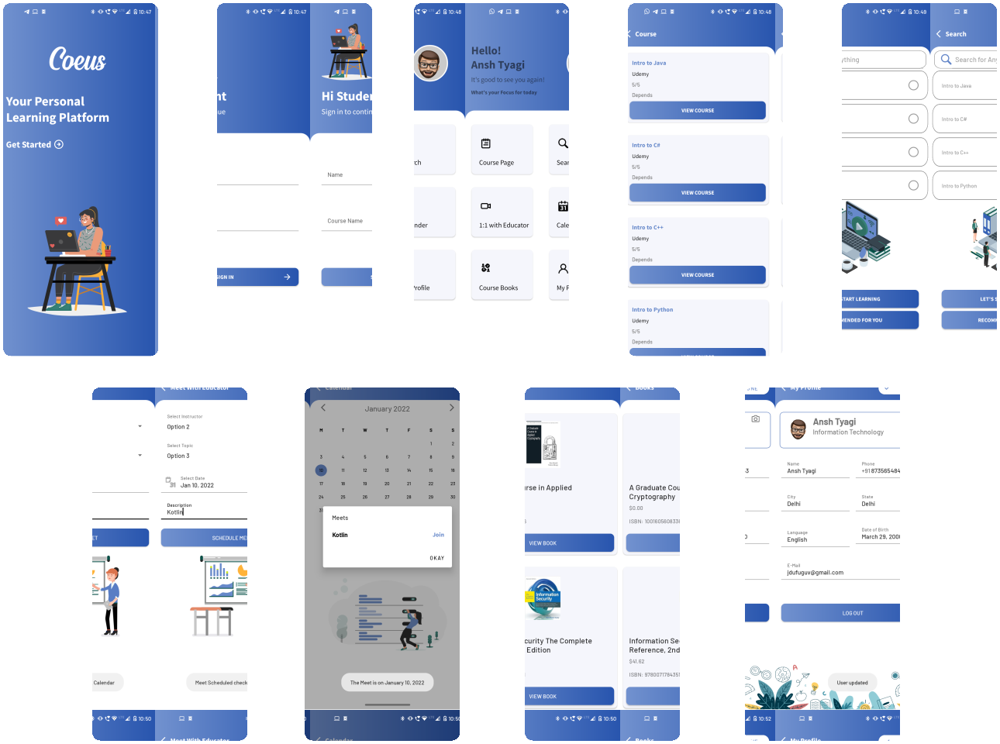

# Android Study Jams

## Coeus - E-Learning App

### Problem Statement :lock_with_ink_pen:
This digital revolution has led to remarkable changes in how the content is consumed, discussed, and shared. Online Education are flexible in a sense that it can be take at anytime depending on students/learner’s availability. Unlike classroom teaching, with online learning you can access the content an unlimited number of times. As compared to traditional classroom teaching method, this mode has relatively quick delivery cycles. This indicates that the time required to learn is reduced to 25%-60% of what is required in traditional learning.

### Proposed Solution :mag:
Coeus (/ˈsiːəs/; Ancient Greek: Κοῖος, Koios, "query, questioning" or "intelligence")  

This project proposes a free E-learning Platform to keep track of your courses and books your major requires. Features include:

- Track and Complete Courses 
- View Books important to your course
- Your personal space to curate the best self-learning experience
- Schedule meets with educators using Jitsi
- Track your schedule with Calendar
- Search the best Courses for yourself
- Simple & Intuitive UI

### Functionality and Concepts Used 🚀
- The app provides a very simple and a user friendly UI, and follows MaterialUI guidelines to help students easily navigate through courses and books and schedule meets.

- Constraint Layout : Most of the activities in the app uses a flexible constraint layout, which is easy to handle for different 
screen sizes.

- RecyclerView : To present the list of courses and list of books we used the RecyclerView.

- Authentication : App authenticates user and stores in RoomDB

- Navigation Component : The app consists of multiple pages and hence navigation comes in handy by the native Navigation Component. A NavGraph, NavHost and NavController is defined and the app uses Single Activity Architecture.  

- LiveData, RoomDatabase & ViewModel : Different ViewModels (MeetViewModel, UserViewModel, BookViewModel) encapsulates LiveData. We are using LiveData to update & observe any changes in the BooksAPI and Profile Page for the User Entity in RoomDB. 

- Coroutines : Since we are making API requests and also fetching and updating data in RoomDB we use concurrency design pattern. Coroutines help us execute code asynchronously. It help to manage long-running tasks that might otherwise block the main thread and cause your app to become unresponsive.

### Application Link 🔗
Release Build can be found [here](https://drive.google.com/file/d/1UsndVOYwLq8nB0cowUdc-6lkik4uc19q/view?usp=sharing)

### Future Scope ⏳
For Courses right now the the data is populated from a hardcoded JSON, to make this app more productive we plan to make a course catalog API or integrating a pre-existing Catalog API to make this app more productive for various fields. We also aim to add search field for books section to search books of any major right now the API only searches for Information Technology books.

### Screenshots 📱

